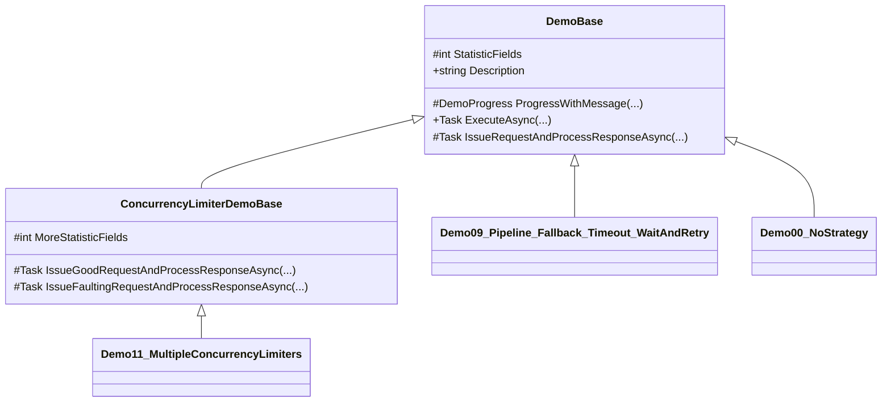

# Polly Demos

- This project contains all the Polly demos.
- This is the only project which is not runnable since it is a class library.

## Exposed functionality

- There are 10 demos to show the basics of Polly.
- There are two extra demos to illustrate the usage of [`ConcurrencyLimiter`](https://www.pollydocs.org/migration-v8.html#migrating-bulkhead-policies).
- Each demo builds on the former one so, the comments are focused only on the new things.
- Every demo runs until it is stopped.
- The demos expose colored logs and statistics via a [`DemoProgress`](OutputHelpers/DemoProgress.cs) data class.

## Structure

- In order to keep the demos Polly focused, the common parts are extracted into base classes.
- This diagram depicts the inheritance hierarchy:
  - _Note: not all `DemoXY`  classes were added to diagram for sake of simplicity._

- Several data classes are defined under the [`OutputHelpers`](OutputHelpers/) directory.
- The [`Configuration`](Configuration.cs) class contains the base URL of the [`PollyTestWebApi`](../PollyTestWebApi/README.md) project.
