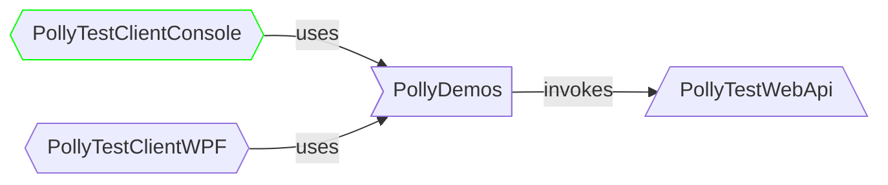

# Polly Test Client Console

- This project provides a CLI to run a Polly demo.



## Exposed functionality

- It lets you start and stop any demo.
- While the demo is running it prompts the logs.
- To stop the demo press _any_ key.
- When you stop the demo you can scrutinize the logs and check the statistics.
- To exit from the application press _any_ key after you assessed the prompted messages.

## Structure

- The [`Program.cs`](Program.cs) is the main entry point.
- To run a new demo, comment out the current one and uncomment the next.
- To switch from the sync to async demos change the value of the  `useSyncDemos` variable to `false`.
- We suggest to run the demos in the same order as they are defined.

## How to run?

- From the `PollySamples` directory:

```none
dotnet run --project PollyTestClientConsole/PollyTestClientConsole.csproj
```

- From the `PollyTestClientConsole` directory:

```none
dotnet run
```

> [!IMPORTANT]
> **Run the `PollyTestWebApi` project as well**
>
> Please make sure that [`PollyTestWebApi`](../PollyTestWebApi/README.md) is also running. <br/>
> Otherwise the demos will not work properly (you will see _connection refused_ messages).
