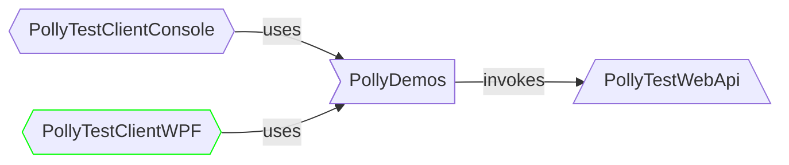

# Polly Test Client WPF

- This project provides a GUI to walk through the Polly demos.



## Exposed functionality

- It provides a dropdown list from which you can choose which demo do you want to run.
- It shows some minimal description about the chosen demo.
- It lets you start, stop and re-run any demo.
- While the demo is running:
  - it prompts the logs with auto-scrolling and;
  - it auto-updates the statistics.
- When you stop the demo:
  - you can scrutinize the logs and;
  - check the final statistics.
- When you start a new demo or restart the previous one then the logs and statistics are reset.

## Structure

- The [`MainWindow.xaml`](MainWindow.xaml) defines the UI components and their layout.
- The [`MainWindow.xaml.cs`](MainWindow.xaml.cs)
  - handles the interactions
  - uses reflection to invoke the selected demo
  - updates the UI whenever there is a progress change
  - handles all sort of errors.

## How to run?

- From the `PollySamples` directory:

```none
dotnet run --project PollyTestClientWpf/PollyTestClientWpf.csproj
```

- From the `PollyTestClientWpf` directory:

```none
dotnet run
```

> [!IMPORTANT]
> **Run the `PollyTestWebApi` project as well**
>
> Please make sure that [`PollyTestWebApi`](../PollyTestWebApi/README.md) is also running. <br/>
> Otherwise the demos will not work properly (you will see _connection refused_ messages).
