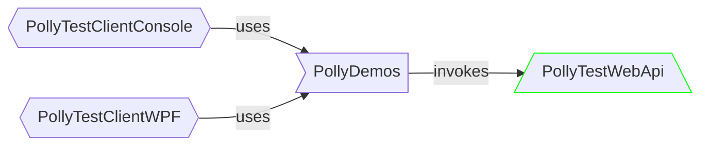

# Polly Test Web API

- This project is a super-lightweight web API.
- It is invoked by the demos.



## Exposed functionality

- It exposes several simple endpoints.
- All of them echo back the received parameter (`{id}`) with some hard-coded prefixes.

### Basic scenarios

#### `GET /api/Values/{id}`

- It simply returns a string.
- It is decorated with rate limiting.
  - It allows 3 requests per 5 seconds.
  - If the threshold is exceeded then it returns an HTTP 429 status code.

### Concurrency limiter scenarios

#### `GET /api/NonThrottledGood/{id}`

- It simply returns a string.
- As its name suggests, it is **not** decorated with rate limiting.

#### `GET /api/NonThrottledFaulting/{id}`

- It waits **5 seconds** before returning a string.
- It emulates slow processing.
- As its name suggests, it is **not** decorated with rate limiting.

### Hedging scenarios

#### `GET /api/VaryingResponseTime/{id}`

- It waits **1 second** +/- several milliseconds before returning a string.
- It emulates varying response processing.
- It is **not** decorated with rate limiting.

#### `GET /api/VaryingResponseStatus/{id}`

- It waits **half a second** before returning a response.
- It emulates varying response status codes.
- It is **not** decorated with rate limiting.

## Structure

- The [`Program.cs`](Program.cs) contains the majority of the codebase
  - the rate limiting policy definition
  - the controllers registration
  - and it exposes the last two endpoint via Minimal API
- The [`Controllers/ValueController.cs`](Controllers/ValuesController.cs)
  - contains the definition of the  `/api/Values/{id}` endpoint
  - decorated with the rate limiting policy

## How to run?

- From the `PollySamples` directory:

```none
dotnet run --project PollyTestWebApi/PollyTestWebApi.csproj
```

- From the `PollyTestWebApi` directory:

```none
dotnet run
```

- The web API will be hosted with Kestrel with `http://localhost:45179` as the base URL.
