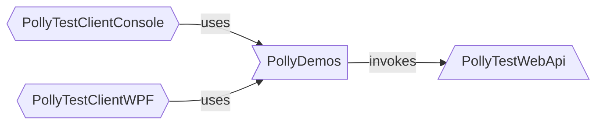

# Polly Test Web API

- This project is a super-lightweight web API.
- It is invoked by the sync and async demos.



## Exposed functionalities

- It exposes three simple endpoints.
- All of them echo back the received parameter (`{id}`) with some hard-coded prefixes.

### `GET /api/Values/{id}`

- It simply returns a string.
- It is decorated with rate limiting.
  - It allows 3 requests per 5 seconds.
  - If the threshold is exceeded then it returns 429.

### `GET /api/NonThrottledGood/{id}`

- It simply returns a string.
- As its name suggests it is NOT decorated with rate limiting.

### `GET /api/NonThrottledFaulting/{id}`

- It waits **5 seconds** before returns a string.
  - It emulates slow processing.
- As its name suggests it is NOT decorated with rate limiting.

## Structure

- The `Program.cs` contains the majority of the codebase
  - the rate limiting policy definition
  - the controllers registration
  - and it exposes the last two endpoint via Minimal API
- The `Controllers/ValueController.cs`
  - contains the definition of the  `/api/Values/{id}` endpoint
  - decorated with the rate limiting policy

## How to run?

- From the `PollySamples` directory:
```none
dotnet run --project PollyTestWebApi/PollyTestWebApi.csproj
```
- From the `PollyTestWebApi` directory:
```none
dotnet run
```
- The Kestrel will host the web API via the `http://localhost:45179` base Url.
