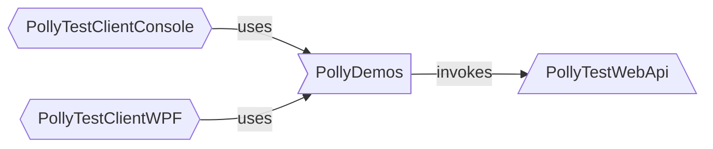

# Polly-Samples

This repository provides sample implementations of using the [Polly library](https://www.github.com/App-vNext/Polly) in a .NET application.

The intent of this project is to help newcomers kick-start the use of Polly within their own projects.

The samples demonstrate the policies in action, against faulting endpoints.

## Projects

The solution contains three applications and one class library:
- `PollyTestWebApi`: This application is a web API with three endpoints. ([Further information](/PollyTestWebApi/README.md))
- `PollyDemos`: This library contains the Polly demos. ([Further information](/PollyDemos/README.md))
- `PollyTestClientConsole`: This application provides a CLI to walk through the demos. ([Further information](/PollyTestClientConsole/README.md))
- `PollyTestClientWpf`: This application provides a GUI to walk through the demos. ([Further information](/PollyTestClientWpf/README.md))

## Demos

### General information

- The demos run against an example 'faulting server'.
  - To simulate failure, the dummy server rejects more than 3 calls in any five-second period.
- Be sure to read the `
` at the top of each demo.
  - This explains the intent of that demo, and what resilience it adds to its handling of the calls to the 'faulting server'.
- Sometimes the `
` also highlights what this demo _doesn't_ achieve, which is often picked up in the following demo.
- Explore the demos in sequence for best understanding.

### Sequence

| # | Description | Link |
| :-: | -- | :-: |
| 00 | No strategy | [Code](PollyDemos/Demo00_NoStrategy.cs) |
| 01 | Retry N times | [Code](PollyDemos/Demo01_RetryNTimes.cs) |
| 02 | Wait and retry N times | [Code](PollyDemos/Demo02_WaitAndRetryNTimes.cs) |
| 03 | Wait and retry N times, N big enough to guarantee success | [Code](PollyDemos/Demo03_WaitAndRetryNTimes_WithEnoughRetries.cs) |
| 04 | Wait and retry forever | [Code](PollyDemos/Demo04_WaitAndRetryForever.cs) |
| 05 | Wait and retry with exponential back-off | [Code](PollyDemos/Demo05_WaitAndRetryWithExponentialBackoff.cs) |
| 06 | Wait and retry nesting circuit breaker | [Code](PollyDemos/Demo06_WaitAndRetryNestingCircuitBreaker.cs) |
| 07 | Wait and retry chaining with circuit breaker by using Pipeline | [Code](PollyDemos/Demo07_WaitAndRetryNestingCircuitBreakerUsingPipeline.cs) |
| 08 | Fallback, Retry, and CircuitBreaker in a Pipeline | [Code](PollyDemos/Demo08_Pipeline-Fallback-WaitAndRetry-CircuitBreaker.cs) |
| 09 | Fallback, Timeout, and Retry in a Pipeline | [Code](PollyDemos/Demo09_Pipeline-Fallback-Timeout-WaitAndRetry.cs) |
| 10 | Without isolation: Faulting calls swamp resources,  also prevent good calls | [Code](PollyDemos/Demo10_SharedConcurrencyLimiter.cs) |
| 11 | With isolation: Faulting calls separated,  do not swamp resources, good calls still succeed | [Code](PollyDemos/Demo11_MultipleConcurrencyLimiters.cs) |
| 12 | Hedging in latency mode | [Code](PollyDemos/Demo12_LatencyHedging.cs) |
| 13 | Hedging in fallback mode: retry only | [Code](PollyDemos/Demo13_FallbackHedging-RetryOnly.cs) |
| 14 | Hedging in fallback mode: retry with fallback | [Code](PollyDemos/Demo14_FallbackHedging-RetryWithFallback.cs) |

## Want further information?

- For any questions about the operation of the demos, ask on this repo [with an issue](https://github.com/App-vNext/Polly-Samples/issues/new/choose).
- For any questions about Polly, ask in the [Polly repository](https://www.github.com/App-vNext/Polly/issues/new/choose).
- For full Polly syntax, see [Polly repository]((https://github.com/App-vNext/Polly#readme)) and the [Polly documentation](https://www.pollydocs.org/).

## Slide decks

View the [slides presented](./slides/AppvNext-DotNetFoundation-Polly-DemoSlides-Nov-2019-generic.pptx) at NDC, DevIntersections and other conferences.

You are welcome to use and adapt this presentation for not-for-profit presentations of Polly to co-workers, user groups and similar, subject to the condition that references to the .NET Foundation, App-vNext and the individual members of the Polly team are retained.
